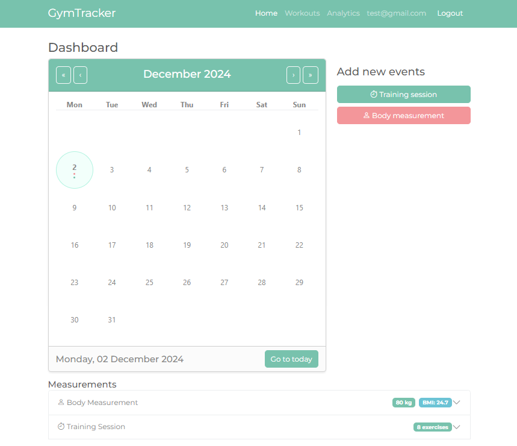
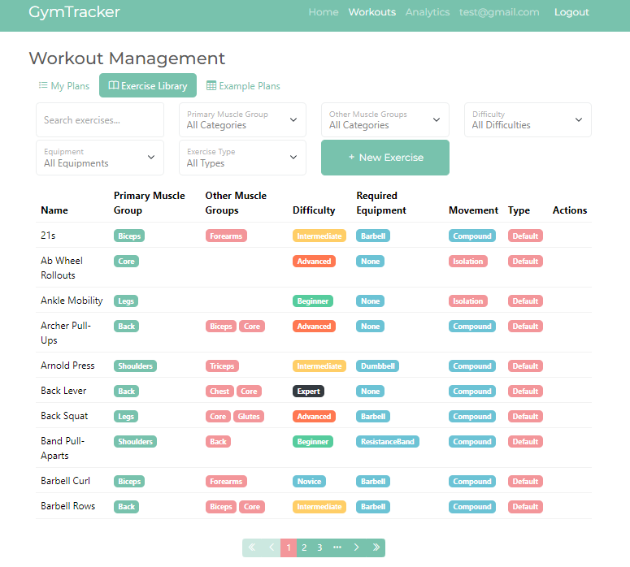
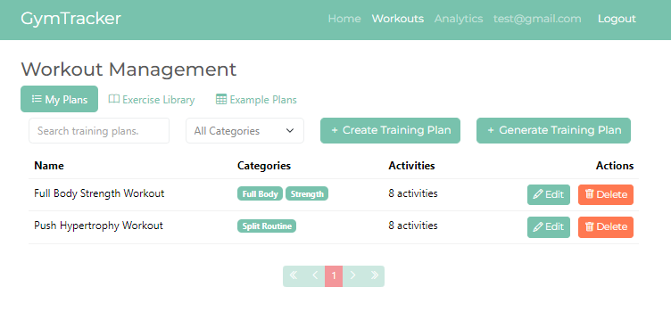
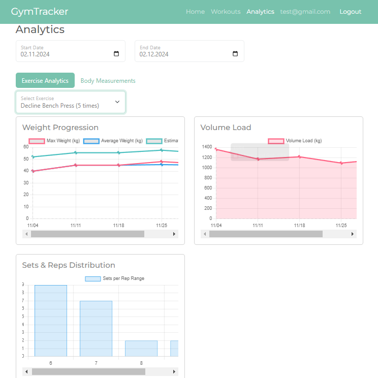
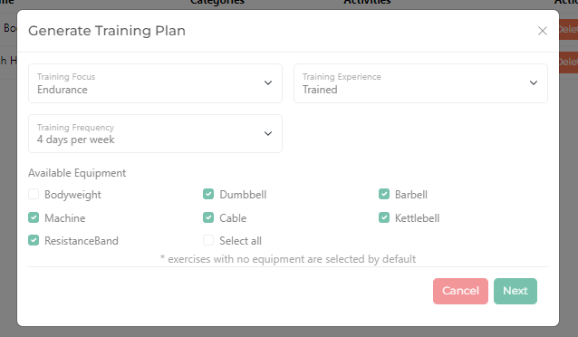
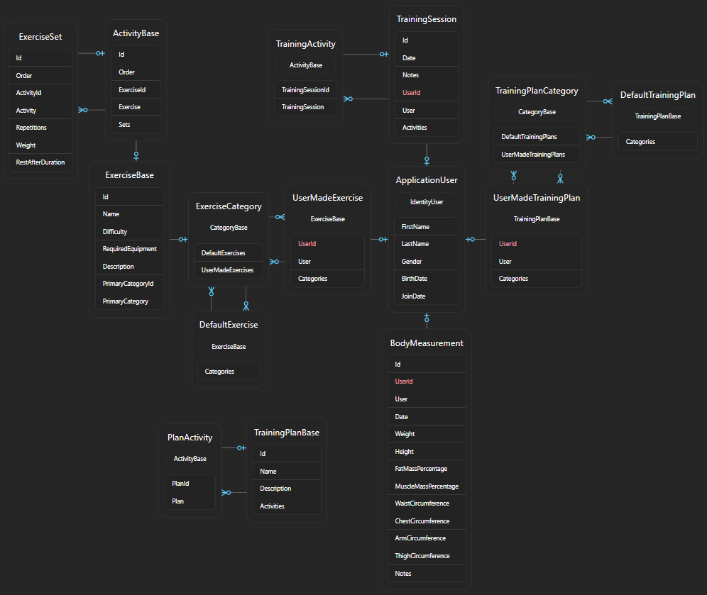

# 💪 Gym Tracker

GymTracker is a comprehensive web application designed for fitness enthusiasts to track their workouts, monitor body measurements, and analyze training progress. Built with Blazor Server and modern .NET technologies, it offers a robust platform for managing your fitness journey.



## ✨ Features

- **🏋️ Exercise Management**

  - Extensive library of predefined exercises
  - Custom exercise creation
  - Categorization and difficulty levels
  - Equipment tracking

- **📋 Training Plans**

  - Ready-to-use workout plans
  - Custom plan creation
  - Smart plan recommendations
  - Category-based organization

- **📊 Progress Analytics**

  - Weight progression tracking
  - Volume load analysis
  - Body measurements monitoring
  - Visual progress charts

- **📅 Training Sessions**
  - Session logging
  - Set and rep tracking
  - Weight and rest period management
  - Notes and comments

## 🛠️ Tech Stack

- **Backend**

  - .NET 8.0
  - ASP.NET Core
  - Entity Framework Core
  - PostgreSQL

- **Frontend**

  - Blazor Server
  - Bootstrap 5
  - Bootswatch Mint Theme
  - BlazorBootstrap

- **Infrastructure**
  - Docker
  - NGINX
  - GitHub Actions
  - Let's Encrypt

## 🚀 Getting Started

### Prerequisites

- .NET 8.0 SDK
- Docker & Docker Compose

### Local Development

1. Clone the repository:

```bash
git clone https://github.com/pietrykovsky/gym-tracker.git
cd gym-tracker
```

2. Set up environment variables:

```bash
cp .env.sample .env
# Edit .env with your settings
```

3. Start the development environment:

```bash
docker compose up -d
```

The application will be available at `http://localhost:5046`

## 📦 Project Structure

```
.
├── GymTracker/              # Main application
│   ├── Components/          # Blazor components
│   ├── Data/               # Data models & context
│   └── Services/           # Business logic layer
├── GymTracker.Tests/       # Test project
└── docker-compose.yml      # Docker configuration
```

## ⚡ Database Migrations

To update the database schema:

```bash
cd GymTracker
dotnet ef database update
```

To create a new migration:

```bash
dotnet ef migrations add <MigrationName>
```

## 🔒 Security

- ASP.NET Core Identity for authentication
- HTTPS enforced in production
- SSL/TLS certificates via Let's Encrypt
- Secure password handling
- Cross-site scripting (XSS) protection

## 🌟 Key Features in Detail

### Exercise Library



- Comprehensive exercise database
- Advanced filtering and search
- Equipment-based categorization

### Training Plans



- Plan templates for different goals
- Customizable workout structures
- Progress tracking

### Analytics Dashboard



- Detailed progress charts
- Performance metrics
- Body composition tracking

### Intelligent Workout Recommendation



The application implements an evidence-based workout routine recommendation system that leverages research in exercise science to generate personalized training programs. The recommendation engine considers multiple factors:

- Training experience level
- Available equipment
- Training frequency
- Fitness goals (strength, hypertrophy, or endurance)

#### Scientific Foundation

The recommendation system is built on established research principles:

- Exercise selection and volume recommendations based on meta-analysis studies [1]
- Progressive overload implementation following researched strength development patterns [2]
- Exercise order optimization based on movement patterns and muscle fiber recruitment [3]
- Rest interval recommendations aligned with specific training goals [4]

The system adapts parameters like training volume, intensity, and exercise selection based on the user's experience level and available training frequency, following peer-reviewed guidelines for optimal strength and muscle development [5].

References:

1. Rhea et al. (2003) - "A meta-analysis to determine the dose response for strength development"
2. Schoenfeld (2010) - "The Mechanisms of Muscle Hypertrophy and Their Application to Resistance Training"
3. Kraemer & Ratamess (2004) - "Fundamentals of Resistance Training: Progression and Exercise Prescription"
4. Schoenfeld et al. (2021) - "Loading Recommendations for Muscle Strength, Hypertrophy, and Local Endurance: A Re-Examination of the Repetition Continuum"
5. Baechle & Earle (2000) - "Essentials of Strength Training and Conditioning"

## 🗃️ Database Structure



### Core Entities

- **ApplicationUser**

  - Extended Identity user with fitness-specific properties
  - Stores user profile data including gender, birth date, and join date

- **BodyMeasurement**

  - Records user's physical measurements
  - Tracks weight, height, body composition, and circumferences
  - Enables progress monitoring over time

- **ExerciseBase (Abstract)**

  - Base class for all exercises
  - Contains common properties: name, difficulty, required equipment
  - Links to primary exercise category

- **DefaultExercise & UserMadeExercise**

  - Two types of exercises: system-provided and user-created
  - Support multiple categories through many-to-many relationships
  - Track exercise difficulty and required equipment

- **TrainingPlanBase (Abstract)**

  - Foundation for training plans
  - Contains plan name, description, and activities
  - Supports both default and user-created plans

- **TrainingSession**
  - Records individual workout sessions
  - Contains date, notes, and collection of activities
  - Links performed exercises with sets and repetitions

### Supporting Entities

- **ActivityBase**

  - Base class for both plan activities and training activities
  - Tracks exercise order and links to specific exercises
  - Contains collection of exercise sets

- **ExerciseSet**

  - Represents individual sets within activities
  - Records repetitions, weight, and rest duration
  - Maintains order within activity

- **Categories**
  - ExerciseCategory and TrainingPlanCategory
  - Enable organization and filtering of exercises and plans
  - Support many-to-many relationships with main entities

### Key Relationships

- Users can create custom exercises and training plans
- Each exercise belongs to one primary category but can have multiple additional categories
- Training sessions reference exercises through activities
- Plans and sessions share similar structure through activity and set entities

## 📝 License

This project is licensed under the MIT License - see the [LICENSE](LICENSE) file for details.
